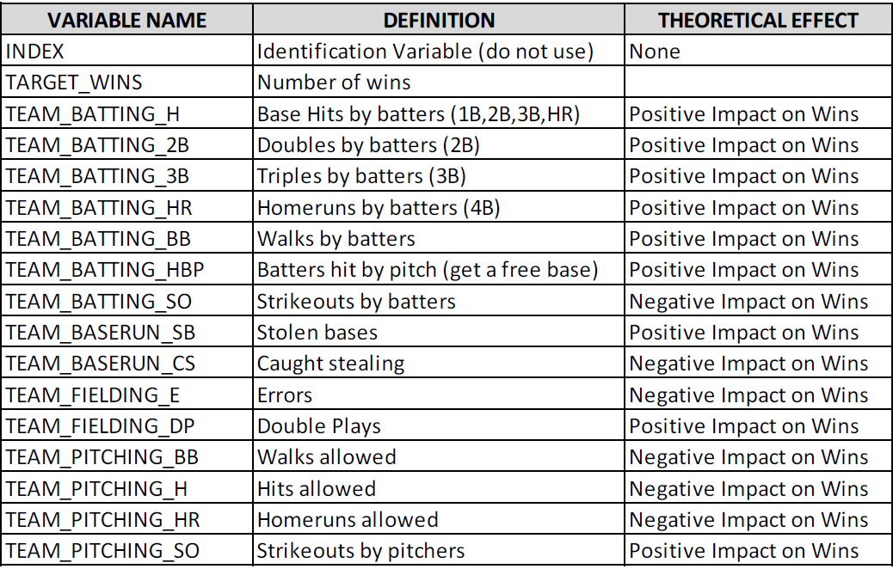

```{r setup, include=FALSE}
knitr::opts_chunk$set(echo = TRUE)
```

## Description of Project

In this project, we are asked to explore, analyze and model a baseball dataset called Moneyball. Each record represents a particular professional baseball team from the years 1871 to 2006 inclusive. Each record has the performance of the given team for the given year, with all of the statistics adjusted to match the performance of a 162 game season.

Our objective is to build a multiple linear regression model on the training data to predict the number of wins for the team.We are also given a test dataset which we will use to predict wins based on the most successful model that we can come up with.

A short description of the variables and their theoretical effect on the response variable 'Number of wins' is provided.


```{r message=FALSE, out.width='70%', fig.show='hold'}

```


## Data Exploration

***Read in the data and packages***

```{r include=FALSE}
library(tidyverse)
library(reshape2)
library(VIM)
library(kableExtra)
library(corrplot)
library(naniar)
library(mice)

```

```{r}
train <- read.csv('moneyball-training-data.csv')
test <- read.csv('moneyball-evaluation-data.csv')
#Removing the index variable
train$INDEX <- NULL
test$INDEX <- NULL
```

Since all the data is for the same team, we will remove the word 'TEAM' from all variables for ease of reading.

```{r}
#Clean train dataset
name_list <- names(train)
name_list <- gsub("TEAM_", "", name_list)
names(train) <- name_list

#We do the same for the test dataset
name_list <- names(test)
name_list <- gsub("TEAM_", "", name_list)
names(test) <- name_list

```

Here is a preview of what the train dataset contains:

```{r}
head(train, 6)
```
The train dataset has 2276 records with 16 variables.Let us look at the structure of the data.

```{r}
str(train)
```
We can see that all of the variables are integers, and BATTING_HBP has a lot of missing values.We will look at the summary of the data to find some idea about the distributions.

```{r}
summary(train)
```
```{r message=FALSE, warning=FALSE, fig.width=10, fig.height= 9, fig.align = 'center'}
m = melt(train)
ggplot(m, aes(x= value)) + 
   geom_density(fill='blue') + 
   facet_wrap(~variable, scales = 'free') +
   theme_classic()
```
We can see that most of the variables have a significant skew. only 4 of the 16 variables are normally or close to normally distributed. The response variable Target_wins seems to be normally distributed.Batting_Hr, Batting_SO and Pitching_HR are bi-modal.

10 of the 16 variables have a minimum value of 0.This does not look like a big problem as the total % of 0 in each column is less than 1%.

```{r}
train %>% 
  gather(variable, value) %>%
  filter(value == 0) %>%
  group_by(variable) %>%
  tally() %>%
  mutate(percent = n / nrow(train) * 100) %>%
  arrange(desc(n)) %>%
  rename(`Variable With Zeros` = variable,
         `Number of Records` = n,
         `Share of Total` = percent) %>%
  kable() %>%
  kable_styling()
```

6 of the variables have a lot of missing values, as outlined below as a % of total:

• BATTING_SO: 102 (4.5% of total)

• BASERUN_SB: 131 (5.8% of total)

• BASERUN_CS: 772 (34% of total, needs to be looked at closely, impute or exclude?)

• BATTING_HBP: 2085 (92% of total, exclude from analysis?)

• PITCHING_SO: 102 (4.5% of total)

• FIELDING_DP: 286 (12.6% of total,needs to be looked at closely, impute or exclude?)

```{r message=F, warning=F}
#Plot missing values using library VIM
mice_plot <- aggr(train, col=c('navyblue','red'),numbers=TRUE, sortVars=TRUE,labels=names(train), cex.axis=.7,gap=3, ylab=c("Missing data","Pattern"))
```


```{r}
#Test for complete rows
print('Percentage of complete case is')
print((sum(complete.cases(train))/nrow(train))*100)
```
**Outliers**

```{r, fig.width=10, fig.height= 9}
ggplot(stack(train[,-1]), aes(x = ind, y = values, fill=ind)) + 
  geom_boxplot(outlier.colour = "red") +
  coord_cartesian(ylim = c(0, 1000)) +
  theme_classic()+
  theme(axis.text.x=element_text(angle=45, hjust=1)) 
  
```
The variables Batting_BB, Batting_CS, Baserun_SB, Pitching_BB and Fielding_E have a significant number of outliers. 

**Correlations among predictors**
```{r}

train %>% 
  cor(., use = "complete.obs") %>%
  corrplot(., method = "color", type = "upper", tl.col = "black", tl.cex=.8, diag = FALSE)
```

There are positive or negative correlations among the predictors. A small number of values are not correlated. Let us look at the numerical correlations with the response variable. We see that the predictors Batting_H, Batting_HR, Batting_BB, Pitching_H, and Pitching_HR are more correlated and should be included in our regression. 

```{r}
correlation <- train %>% 
  cor(., use = "complete.obs") %>%
  as.data.frame() %>%
  rownames_to_column()%>%
  gather(Variable, Correlation, -rowname) 

correlation %>%
  filter(Variable == "TARGET_WINS") %>%
  kable() %>%
  kable_styling()
```

Let us look at significant correlations among the independent variables. We see that four of the pairs have a correlation close to 1. This can lead to autocorrelation errors in our analysis.

```{r}
correlation %>%
  filter(abs(Correlation) > .5 & Correlation!=1 ) %>%
  distinct(Correlation, .keep_all = T)%>%
  kable() %>%
  kable_styling()
```

## Data Preparation

First we will remove Batting_HBP (Hit by Pitch) which has 92% missing values. I am also assuming the 0 values (a very small part of each variable) are coding mistakes and converting them to NA.

```{r}
train <- train[-10]
is.na(train) <- !train
```

We will look at the patterns and intersections of missingness among the variables, using the naniar package. We can see that only 22 of the observations have all 5 variables missing, we will just delete these cases. The pattern suggests that the variables are Missing at Random (MAR)
```{r}
par(mfrow=c(1,2))
gg_miss_upset(train, 
              nsets = 5,
              nintersects = NA)
gg_miss_case(train)+
  theme_classic()

```

```{r}
train<-train%>%
   mutate(rowsum=rowSums(is.na(train)))%>%
   filter(rowsum<5)%>%
   select(-rowsum)
```

In deciding whether data is MCAR or MAR, one approach is to explore patterns of missingness between variables. This is particularly important for a primary outcome measure/dependent variable. We will test the two cases with most missing values.

The wins for players who’s Baserun_cs data is known is the blue box plot, and the wins with missing Baserun_cs data is the gray box plot.We do not see a lot of difference in the mean, but the Interquartile range has changed. Also the mean changes significantly between Fielding_DP and Baserun_cs if we do not include missing data. 

```{r message=F, warning=F}
library(finalfit)
explanatory <- c('BASERUN_CS','FIELDING_DP' )
dependent <- 'TARGET_WINS'
train %>% 
  missing_pairs(dependent, explanatory)
```

102 of the observations have 3 of the variables missing.The highest case missing is in the BASERUN_CS variable, so this deserves an analysis of its own.We find a highly positively skewed distribution with most missing data after the 125 on the x axis. We want to make sure that the shape of our distribution does not change as we impute the data.

```{r}
train %>% 
  ggplot(aes(BASERUN_CS)) + 
  geom_histogram(bins = 50) +
  geom_vline(aes(xintercept = mean(BASERUN_CS, na.rm = T)), col = "red", lty = 2) +
  geom_vline(aes(xintercept = median(BASERUN_CS, na.rm = T)),col = "green", lty = 2) +
  labs(x = element_blank(),
       y = "Count",
       title = "Distribution of Caught Stealing Bases",
       caption = "* Red line is the mean value and green is the median")
```

**Imputing the data**

We are going to use the mice method sample to impute the data, as we tested several methods and found this one returns closest to statistics measured in the original data.

```{r}
temp <- mice(train,m=5,maxit=10,meth='sample',seed=500, printFlag = F)
imputed_train<- complete(temp)
#Testing for statistics
summary(train$BASERUN_CS)
summary(imputed_train$BASERUN_CS)
```
## Build Models

Let us run a regression on all of the variables.

```{r}
fit<-lm(TARGET_WINS~., imputed_train)
summary(fit)
res <- residuals(fit)
plot(fit)
```
We see that 7 of the variables are not statistically significant. 


```{r}
fit<-lm(TARGET_WINS~BATTING_H+BATTING_HR+BATTING_BB+PITCHING_H+PITCHING_HR+PITCHING_BB, imputed_train)
summary(fit)
```
heteroscedasticity:

```{r}
lmtest::bptest(fit)
plot(fit)
```
