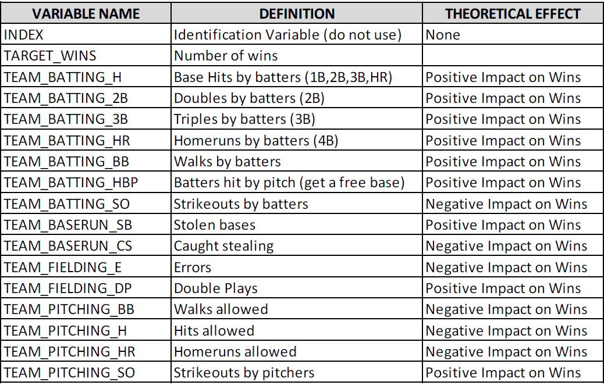

\newpage


```{r, message=FALSE,warning=FALSE, include=F, echo=F}
# loading libraries
library(tidyr)
library(tidyverse)
library(knitr)
library(kableExtra)
library(stargazer)
library(DT)
library(forcats)
library(reshape2)
library(naniar) # for missing values
library(corrplot) # for plotting correlation matrix
library(imputeTS)
library(e1071) # To check skewness
library(caret)
library(finalfit)
library(jtools)
library(mice)
library(VIM) # Prints out the summary table of lm in a pretty way using summ() function
library(performance) # This package is to use check_model() for performance of model
library(see) # This packages is also used to support check_model()
```

## Executive Summary

The team has developed a model using historical baseball data to determine a team's performance based on statistics of their performance. While correlation does not equal causation it is suggested that a focus on some of the variables such as a focus on either single hits or triple or more hits to the exclusion of doubles might be worth pursuing. Also the data suggests that a focus on home runs allowed may not be worth giving up a number of more normal hits. 


## Data Used

In this project, we are asked to explore, analyze and model a baseball dataset. Each record represents a particular professional baseball team from the years 1871 to 2006 inclusive. Each record has the performance of the given team for the given year, with all of the statistics adjusted as if the team were playing a 162 game season.

Our objective is to build a multiple linear regression model on the training data to predict the number of wins for the team, based on their other performance variables. This data set is split between a training dataset of 2276 observation for model development and a test dataset of 259 observations for model validation. 

A short description of the variables and their theoretical effect on the response variable 'Number of wins' is provided.


```{r message=FALSE, echo=F, out.width='90%', fig.show='hold'}

```

```{r message=FALSE, output=F, echo=F, warning=FALSE}
# train <- read.csv('https://raw.githubusercontent.com/habibkhan89/Data621/master/Homework%201/moneyball-training-data.csv')
# test <- read.csv('https://raw.githubusercontent.com/habibkhan89/Data621/master/Homework%201/moneyball-evaluation-data.csv')
train <- read.csv('./moneyball-training-data.csv')
test <- read.csv('moneyball-evaluation-data.csv')
#Removing the index variable
train$INDEX <- NULL
test$INDEX <- NULL
#Clean train dataset
name_list <- names(train)
name_list <- gsub("TEAM_", "", name_list)
names(train) <- name_list

#We do the same for the test dataset
name_list <- names(test)
name_list <- gsub("TEAM_", "", name_list)
names(test) <- name_list

```

\newpage
## Data exploration

Looking at the data it is clear that all of the data is numeric, and that Hit By Pitch has a lot of missing variables. 

```{r echo=F}
summary(train)
```


6 of the variables have missing values:

• BATTING_SO: 102 (4.5% of total)

• PITCHING_SO: 102 (4.5% of total)

• BASERUN_SB: 131 (5.8% of total)

• BASERUN_CS: 772 (34% of total, needs to be looked at closely, impute or exclude?)

• BATTING_HBP: 2085 (92% of total, exclude from analysis?)

• FIELDING_DP: 286 (12.6% of total,needs to be looked at closely, impute or exclude?)

The following diagram shows the missingness pattern by variables.

```{r message=F, warning=F, echo=F, results=F}
#Plot missing values using library VIM
mice_plot <- aggr(train, col=c('navyblue','red'),numbers=TRUE, sortVars=TRUE,labels=names(train), cex.axis=.7,gap=3, ylab=c("Missing data","Pattern"))
```

\newpage
### Outliers

The following diagram shows the outliers for all the variables, both dependent and independent.

```{r, fig.width=10, fig.height= 9, echo=F, warning=F}
ggplot(stack(train[,-1]), aes(x=ind, y = values, fill=ind)) + 
  geom_boxplot(outlier.colour = "red",  outlier.alpha=.4) +
  coord_cartesian(ylim = c(0, 2000)) +
  theme_classic()+
  theme(axis.text.x=element_text(angle=45, hjust=1)) 
  
```

We can see that 12 of the variables have a significant skew. only 4 of the 16 variables are normally or close to normally distributed. The response variable Target_wins seems to be normally distributed. Batting_Hr, Batting_SO and Pitching_HR are bi-modal.

10 of the 16 variables have a minimum value of 0. This is not a major concern as the total % of 0 in each column is less than 1%.

The variables Batting_BB, Batting_CS, Baserun_SB, Pitching_BB and Fielding_E have a significant number of outliers. 


### Correlations among predictors
```{r echo=F}

train %>% 
  cor(., use = "complete.obs") %>%
  corrplot(., method = "color", type = "upper", tl.col = "black", tl.cex=.8, diag = FALSE)
```

There are positive or negative correlations among the predictors. A small number of values are not correlated. Let us look at the numerical correlations with the response variable. We see that the predictors Batting_H, Batting_HR, Batting_BB, Pitching_H, and Pitching_HR are more correlated and should be included in our regression. 

```{r message=FALSE, echo=F, warning=F}
correlation <- train %>% 
  cor(., use = "complete.obs") %>%
  as.data.frame() %>%
  rownames_to_column()%>%
  gather(Variable, Correlation, -rowname) 

correlation %>%
  filter(Variable == "TARGET_WINS") %>%
     arrange(desc(Correlation))  %>%
  kable() %>%
  kable_styling()
```
```{r echo=F}
correlation %>%
  filter(abs(Correlation) > .5 & Correlation!=1 ) %>%
  distinct(Correlation, .keep_all = T) %>% 
  kable() %>%
  kable_styling()
```

Examining significant correlations among the independent variables, we see that four of the pairs have a correlation close to 1. This can lead to multicollinearity issues in our analysis.


## Data Preparation
```{r message=F,echo=F, warning=F, results=F}
par(mfrow=c(1,2))
gg_miss_upset(train, 
              nsets = 5,
              nintersects = NA)
gg_miss_case(train)+
  theme_classic()

```

```{r message=F,echo=F, warning=F, results=F}
train<-train%>%
   mutate(rowsum=rowSums(is.na(train)))%>%
   filter(rowsum<5)%>%
   select(-rowsum)
```
We will look at the patterns and intersections of missing data among the variables. We can see that only 22 of the observations have all 5 variables missing, so we are completely removing these observations. Overall, the pattern suggests that the variables are Missing at Random (MAR)

In deciding whether data is MCAR (Missing Completely At Random) or MAR, one approach is to explore patterns of missingness between variables. This is particularly important for a primary outcome measure/dependent variable. We will test the two cases with most missing values.


```{r message=F,echo=F, warning=F, results=F}
library(finalfit)
explanatory <- c('BASERUN_CS','FIELDING_DP' )
dependent <- 'TARGET_WINS'
train %>% 
  missing_pairs(dependent, explanatory)
```


The wins for teams whose Caught Stealing (Baserun_cs) data is known is the blue box plot, and the wins with missing Baserun_cs data is the gray box plot. We do not see a lot of difference in the mean, but the Interquartile range has changed. Also the mean changes significantly between Double Play (Fielding_DP) and Baserun_cs if we do not include missing data. 

102 of the observations have 3 of the variables missing.The highest case missing is in the BASERUN_CS variable, so this deserves an analysis of its own.We find a highly positively skewed distribution with most missing data after the 125 on the x axis. We want to make sure that the shape of our distribution does not change as we impute the data.

```{r echo=F, warning=F, results=F}
train %>% 
  ggplot(aes(BASERUN_CS)) + 
  geom_histogram(bins = 50) +
  geom_vline(aes(xintercept = mean(BASERUN_CS, na.rm = T)), col = "red", lty = 2) +
  geom_vline(aes(xintercept = median(BASERUN_CS, na.rm = T)),col = "green", lty = 2) +
  labs(x = element_blank(),
       y = "Count",
       title = "Distribution of Caught Stealing Bases",
       caption = "* Red line is the mean value and green is the median")
```


\newpage

```{r, message=FALSE, output=F, echo=F, warning=FALSE}
train <- read_csv('https://raw.githubusercontent.com/habibkhan89/Data621/master/Homework%201/moneyball-training-data.csv', col_names = TRUE)[,-1] 
test <- read_csv('https://raw.githubusercontent.com/habibkhan89/Data621/master/Homework%201/moneyball-evaluation-data.csv',col_names=TRUE)[,-1] 

# Renaming the column names to make them less complicated
colnames(train) <- gsub("TEAM_", "", colnames(train))
colnames(test) <- gsub("TEAM_", "", colnames(test))

```


## Data Preparation for Modeling

### Model 1 - Basic Model

This model is created through removing basic extreme outliers from Hits Allowed and Strikeouts by Pitchers Also, the data for hit by pitcher had 92% missing values requiring its removal. 

In this model, we replace the missing values for each column with their median. 

```{r message=FALSE, output=F, echo=F, warning=FALSE}
# Replacing extreme values with median for training & evaluation datasets and removing BATTING_HBP which has 92% missing values
train2 <- train %>% mutate(PITCHING_H = if_else(PITCHING_H > 5000, median(PITCHING_H), PITCHING_H),
                            PITCHING_SO = if_else(PITCHING_SO > 1500, median(PITCHING_SO), PITCHING_SO)) %>% 
  select(-BATTING_HBP)

test2 <- test %>% mutate(PITCHING_H = if_else(PITCHING_H > 5000, median(PITCHING_H), PITCHING_H),
                            PITCHING_SO = if_else(PITCHING_SO > 1500, median(PITCHING_SO), PITCHING_SO)) %>% 
  select(-BATTING_HBP)


```


All the missing values were replaced by the median of it's column. Most of the variables don't have extreme outliers but still it has some sort of skewness but we won't remove them because it might change the model's fitness. We will fix the model in next steps and check which model performs better. Variables like Hits Allowed and Walks by Batters are skewed significantly which we have to transform in next models. 

```{r echo=F, warning=F, results=F}
# Replacing missing values with median
train2[] <- lapply(train2, function(x) ifelse(is.na(x), median(x, na.rm=TRUE), x))
test2[] <- lapply(test2, function(x) ifelse(is.na(x), median(x, na.rm=TRUE), x))


# Verifying for missing values
#sapply(train2, function(x) sum(is.na(x)))
#vis_miss(train2) # From naniar library

# Checking skewness
#sapply(train2, function(x) skewness(x))
```

### Model 2 - Log Transformation

In this model, we use log transformation to transform skewed distributions into normally distributed shape. Skewness improved after applying log transformation on highly skewed variables. We must apply log transformation to both training and test datasets to maintain consistency. We used log10 and added 1 on each skewed variable to avoid log having an undefined result for our many 0 values. We applied this transformation on the following variables:

* Walks By Batters
* Hits Allowed by Pitcher
* Fielding Errors
* Stolen Bases
* Caught Stealing

Skewness is comparatively much better now as it was in previous model. 

```{r message=FALSE, output=F, echo=F, warning=FALSE}
train_log <- train2 # Model 2
test_log <- test2

# Applying log transformation for highly skewed variables
#training
train_log$PITCHING_BB <- log10(train_log$PITCHING_BB + 1)
train_log$PITCHING_H <- log10(train_log$PITCHING_H + 1)
train_log$FIELDING_E <- log10(train_log$FIELDING_E + 1)
train_log$BASERUN_SB <- log10(train_log$BASERUN_SB + 1)
train_log$BASERUN_CS <- log10(train_log$BASERUN_CS + 1)
#test
test_log$PITCHING_BB <- log10(test_log$PITCHING_BB + 1)
test_log$PITCHING_H <- log10(test_log$PITCHING_H + 1)
test_log$FIELDING_E <- log10(test_log$FIELDING_E + 1)
test_log$BASERUN_SB <- log10(test_log$BASERUN_SB + 1)
test_log$BASERUN_CS <- log10(test_log$BASERUN_CS + 1)


# CHecking skewness
sapply(train_log, function(x) skewness(x))

# Printing summary statistics
#summary(train_log)

# Skewness
ggplot(melt(train_log), aes(x=value))+geom_density()+facet_wrap(~variable, scales='free')

```


### Model 3 - BoxCox Transformation

In this model, we are going to apply a  BoxCox transformation but also center and scale. This means that we want to subtract the mean of predictor's data from predictor's values while scale divides by the standard deviation. We were hoping this model to perform better but the resultant data skewness was not remediated as well as it was log transformation.

```{r message=FALSE, output=F, echo=F, warning=FALSE}
# Converting tibble to df
train_data_bx <- data.frame(train2) 
test_data_bx <- data.frame(test2)

dim(test2)
# PreProcess function for boxcox transformation
preproc_value <- preProcess(train_data_bx[,-1], c("BoxCox", "center", "scale"))

# Transformation
train_bx_transformed <- predict(preproc_value, train_data_bx)
test_bx_transformed <- predict(preproc_value, test_data_bx)

# Normality and skewness
ggplot(melt(train_bx_transformed), aes(x=value))+geom_density()+facet_wrap(~variable, scales='free')
sapply(train_bx_transformed, function(x) skewness(x))
```

### Model 4 - kNN Imputation on missing values

In model 4, we are going to replace the missing values with kNN using the Caret R package. We decided to remove Hit By Pitcher and Caught Stealing as they had 92% and 33% missing values respectively. We want to see if kNN Imputation along with other selected variables might give better results. After imputation, we used log transformation with the kNN imputed values to see if it will improve the model's fitness. Again for consistency, we have to apply all transformation on both training and datasets 

*kNN Imputation*

As it may be unfamiliar to some, kNN is a method of building a model to impute data. While in theory a more sophisticated model could be used, kNN has some advantages in being simple and well understood. 

```{r message=FALSE, output=F, echo=F, warning=FALSE}
set.seed(1100)
library(VIM)

# knn imputation for missing values
# training
train_data_knn <- train %>% # TRAINING 
  select(-BATTING_HBP, -BASERUN_CS) 
train_knn <- kNN(train_data_knn, variable = c("BATTING_SO", "BASERUN_SB", "PITCHING_SO","FIELDING_DP"),k=6)

#test
test_data_knn <- test %>% # TEST
  select(-BATTING_HBP, -BASERUN_CS) 
test_knn <- kNN(test_data_knn, variable = c("BATTING_SO", "BASERUN_SB", "PITCHING_SO","FIELDING_DP"),k=6)

# CHecking for missing values
colSums(is.na(train_knn))

# Log transformation on knn imputed dataset
train_knn_log <- train_knn # Model 2
test_knn_log <- test_knn
#test_log <- test2

# Applying log transformation for highly skewed variables
#training
train_knn_log$PITCHING_BB <- log10(train_knn_log$PITCHING_BB + 1)
train_knn_log$PITCHING_H <- log10(train_knn_log$PITCHING_H + 1)
train_knn_log$FIELDING_E <- log10(train_knn_log$FIELDING_E + 1)
train_knn_log$BASERUN_SB <- log10(train_knn_log$BASERUN_SB + 1)

# TEST DATASET TRANSFORMATION
test_knn_log$PITCHING_BB <- log10(test_knn_log$PITCHING_BB + 1)
test_knn_log$PITCHING_H <- log10(test_knn_log$PITCHING_H + 1)
test_knn_log$FIELDING_E <- log10(test_knn_log$FIELDING_E + 1)
test_knn_log$BASERUN_SB <- log10(test_knn_log$BASERUN_SB + 1)

# CHecking skewness and normality
sapply(train_knn_log, function(x) skewness(x))
ggplot(melt(train_knn_log), aes(x=value))+geom_density()+facet_wrap(~variable, scales='free')
```


\newpage
## Build Models

### Model 0 ... a Sanity check

Using the imputed data we can simply run a linear regression against all the variables.

```{r message=FALSE, output=F, echo=F, warning=FALSE, results='asis'}
dependent <- "TARGET_WINS"
explanatory <- colnames(train2[,-1])
model0 <- lm(TARGET_WINS ~ ., data = subset(train2, select=append(explanatory, dependent)))
stargazer(model0, header=FALSE, type='latex')
```
First of all the significance of the model is significant as per the p-value of F-statistics. It means that overall the model is significant. Adjusted r2 is 0.32 which means these variables can explain 32% of TARGET_WINS. All the variables other than BASERUN_CS and PITCHING_SO are insignificant. BASERUN_CS has 33% missing values which should have negative impact and it has negative but insignificant. It means Caught Stealing and it does not impact the chances of winning significantly. PITCHING_SO means strikeouts by pitchers which also has insigificant impact on TARGET_WINS. BATTING_2B should have positive impact but in model it shows significant but with very little coefficient.  BATTING_HR means homeruns by batters should've and have positive impact on chances of winning. BATTING_BB means walks by batter. It should have positive impact but in our model it has insignificant impact. BATTING_SO means strikeouts by batters which shoul've negative impact but in our model it does not play significant role. BASERUN_SB should've significant impact and it has positive role. BASERUN_CS, PITCHING_HR and PITCHING_SO have insignificant impact while PITCHING_H, PITCHING_BB, FIELDING_E and FIELDING_DP have significant roles. 

$$TARGET_WINS = 19.02 + BATTING_H(0.04) - BATTING_2B(0.02) + BATTING_3B(0.07) +$$ $$BATTING_HR(0.09) + BASERUN_SB(0.03) + PITCHING_H(0.01) + PITCHING_BB(0.01)$$
$$- FIELDING_E (0.03) - FIELDING_DP(0.11)$$

\newpage
### Model 1 Basic Model

We select variable that seem correlated for this simple direct model.

Namely:

* Base Hits by Batters Batting_H
* Doubles by Batters Batting_2H
* Triples By Batters Batting_3B
* Home Runes Batting_HR
* Stolen Bases Baserun_SB
* Hits Allowed Pitching_H
* Walks Allowed Pitching_BB
* Errors in Fielding Fielding_E
* Double Plays Fielding_DP

All have a fairly direct impact on scoring or runs allowed. 


```{r message=FALSE, output=F, echo=F, warning=FALSE, results='asis'}
dependent <- "TARGET_WINS"
explanatory <- c("BATTING_H","BATTING_2B","BATTING_3B","BATTING_HR","BASERUN_SB","PITCHING_H", "PITCHING_BB", "FIELDING_E", "FIELDING_DP")
model1 <- lm(TARGET_WINS ~ ., data = subset(train2, select=append(explanatory, dependent)))

stargazer(model1, header=FALSE, type='latex')
```
This model's Adjusted R2 is also .32 which suggests our model is performing perfectly well without the other variables. This makes the model a bit less pointlessly confusing. 

\newpage
### Model 2 Log Transformation

For this model we use the log adjusted values adding in the adjusted Caught Stealing. In addition to the previously present, but now adjusted:

* Walks By Batters
* Hits Allowed by Pitcher
* Fielding Errors
* Stolen Bases

```{r message=FALSE, output=F, echo=F, warning=FALSE, results='asis'}
dependent <- "TARGET_WINS"
explanatory <- c("BATTING_H","BATTING_2B","BATTING_3B","BATTING_HR","BASERUN_SB","PITCHING_H", "PITCHING_BB", "FIELDING_E", "FIELDING_DP","BASERUN_CS")
model2 <- lm(TARGET_WINS ~ ., data = subset(train_log, select=append(explanatory, dependent)))

stargazer(model2, header=FALSE, type='latex')
```
Adjusted-r2 did not improve overall as compared with model 1 and intercept is no longer significant in this model. The additional Caught Stealing variable is significant, but with the loss of a significant intercept it is a wash. This does not seem a preferred model because log transformations are complex to intuit, and it doesn't seem to offer a meaningful benefit.

\newpage
### Model 3 BoxCox Transformation

For the BoxCox transformed data set we will continue with the same variables as previously. 

```{r message=FALSE, output=F, echo=F, warning=FALSE, results='asis'}

dependent <- "TARGET_WINS"
explanatory <- c("BATTING_H","BATTING_2B","BATTING_3B","BATTING_HR","BASERUN_SB","PITCHING_H", "PITCHING_BB", "FIELDING_E", "FIELDING_DP","BASERUN_CS")
model3 <- lm(TARGET_WINS ~ ., data = subset(train_bx_transformed, select=append(explanatory, dependent)))

stargazer(model3, header=FALSE, type='latex')

```
With boxcox transformation, intercept is now again significant but adjusted r-square dropped to .29. We have lost two variables to insignificance with Caught Stealing becoming particular meaningless. 

\newpage
### Model 4 kNN Imputation

With our log adjusted KNN we will take all 13 variables. 
```{r message=FALSE, output=F, echo=F, warning=FALSE, results='asis'}
model4 <- lm(TARGET_WINS ~ ., train_knn_log)

stargazer(model4, header=FALSE, type='latex')
```
It appears that knn-imputation along with log transformation improved the adjusted r-square from 0.33 to 0.39 from model 3. As discussed merely depending upon adjusted r-square is not advised. According to new model BATTING_HR is insignificant all the other variables are significant at 10 % confidence interval which means result did improve here. BATTING_2B is negative though but consistent with all models but to very low extent. BATTING_SO, PITCHING_H, PITCHING_BB and PITCHING_E have also negative impact which comports with the theoretical impact.

Our model will be:
$$TARGET_WINS = 154.048 + BATTING_H (0.05) - BATTING_2B (0.04) + BATTING_3B (0.10) +$$ $$BATTING_BB (0.04) - BATTING_SO (0.02) + BASERUN_SB (12.89) - PITCHING_H (9.25) +$$ $$PITCHING_HR (0.08) - PITCHING_BB (9.83) + PITCHING_SO (0.00) - FIELDING_E (46.98) -$$ $$FIELDING_DP (0.14)$$

\newpage

## Select Model

As discussed we would prefer to select Model 4 because it not only improved adjusted r-square but the intercept also became significant which was not the case in model 3. In addition, the significance and directions of each variable's impact on TARGET_WINS mostly accords with the theoretical effect, and intuition. We found that knn imputation along with log transformation improved the model significantly in comparison with other techniques. It also shows that we cannot randomly just replace the missing values with mean or median. The analystm must check our models with different criteria to see which transformation techniques do well overall in terms of not only r-square but also we have to see if the result actually makes sense or not. At this point we are convinced about performance of model 4 but we'll take one step extra and double check. 

```{r, warning=FALSE, message=FALSE, echo=F}
# Checking the overall performance of model
model_test <- lm(TARGET_WINS ~ BATTING_H + BATTING_2B + BATTING_3B + BATTING_BB + BATTING_SO + BASERUN_SB + PITCHING_H + PITCHING_HR + PITCHING_BB + PITCHING_SO + FIELDING_E + FIELDING_DP, data=train_knn_log)
check_model(model_test)
```
Data looks normally distributed but looks like there are high collinearity among some of the variables as shown below which might be affect their significance or coefficients in final model. According to Jim Frost, multicollinearity does not influence the predictions, precision and goodness of fit. He adds that if primary goal is to make predictions then you do not have to understand the role of each independent variable.  There is some homoskedasticity in residuals as shown in graph 2 in second row. 


```{r echo=F}
# CHecking multicollinearity
check_collinearity(model_test)

# Checking model performance
model_performance(model_test)
```

It seems that model 4's performance is almost consistent with other models in terms of collinearity and RMSE but adjusted r2 is comparatively better than others. The model, also makes intuitive sense. This suggests it should be selected. Now that we have selected model 4 as a best among the others, let's move ahead and predict the target wins by predicting the test dataset on Model 4. 

```{r echo=F}
test_knn_log$TARGET_WINS <- round(predict(model_test, test_knn_log),0)
test_knn_log %>% select(TARGET_WINS, everything())%>%head() %>% kable() %>% kable_styling()
```


\newpage
## Appendix 1 R Code

Since all the data is for the same team, we will remove the word 'TEAM' from all variables for ease of reading.

```{r eval=FALSE, echo=TRUE}
#Clean train dataset
name_list <- names(train)
name_list <- gsub("TEAM_", "", name_list)
names(train) <- name_list

#We do the same for the test dataset
name_list <- names(test)
name_list <- gsub("TEAM_", "", name_list)
names(test) <- name_list

```

Here is a preview of what the train dataset contains:

```{r}
head(train[1], 6)
```
The train dataset has 2276 records with 16 variables.Let us look at the structure of the data.

```{r}
str(train)
```
We can see that all of the variables are integers, and BATTING_HBP has a lot of missing values.We will look at the summary of the data to find some idea about the distributions.

```{r }
summary(train)
```
```{r message=FALSE, warning=FALSE, fig.width=10, fig.height= 9, fig.align = 'center'}
m = melt(train)
ggplot(m, aes(x= value)) + 
   geom_density(fill='blue') + 
   facet_wrap(~variable, scales = 'free') +
   theme_classic()
```
We can see that 12 of the variables have a significant skew. only 4 of the 16 variables are normally or close to normally distributed. The response variable Target_wins seems to be normally distributed.Batting_Hr, Batting_SO and Pitching_HR are bi-modal.

10 of the 16 variables have a minimum value of 0. This is not a major concern as the total % of 0 in each column is less than 1%.

```{r message=FALSE, output=F, echo=T, eval=F, warning=FALSE}
train %>% 
  gather(variable, value) %>%
  filter(value == 0) %>%
  group_by(variable) %>%
  tally() %>%
  mutate(percent = n / nrow(train) * 100) %>%
  arrange(desc(n)) %>%
  rename(`Variable With Zeros` = variable,
         `Number of Records` = n,
         `Share of Total` = percent) %>%
  kable() %>%
  kable_styling()
```

6 of the variables have above 4% missing values:

• BATTING_SO: 102 (4.5% of total)

• PITCHING_SO: 102 (4.5% of total)

• BASERUN_SB: 131 (5.8% of total)

• BASERUN_CS: 772 (34% of total, needs to be looked at closely, impute or exclude?)

• BATTING_HBP: 2085 (92% of total, exclude from analysis?)


• FIELDING_DP: 286 (12.6% of total,needs to be looked at closely, impute or exclude?)

```{r message=F, warning=F}
#Plot missing values using library VIM
mice_plot <- aggr(train, col=c('navyblue','red'),numbers=TRUE, sortVars=TRUE,labels=names(train), cex.axis=.7,gap=3, ylab=c("Missing data","Pattern"))
```


```{r}
#Test for complete rows
print('Percentage of complete case is')
print((sum(complete.cases(train))/nrow(train))*100)
```
**Outliers**

```{r, message=FALSE, output=F, echo=T, eval=F, warning=FALSE, fig.width=10, fig.height= 9}
ggplot(stack(train[,-1]), aes(x = ind, y = values, fill=ind)) + 
  geom_boxplot(outlier.colour = "red",  outlier.alpha=.4) +
  coord_cartesian(ylim = c(0, 1000)) +
  theme_classic()+
  theme(axis.text.x=element_text(angle=45, hjust=1)) 
  
```
The variables Batting_BB, Batting_CS, Baserun_SB, Pitching_BB and Fielding_E have a significant number of outliers. 

**Correlations among predictors**
```{r message=FALSE, output=F, echo=T, eval=F, warning=FALSE}

train %>% 
  cor(., use = "complete.obs") %>%
  corrplot(., method = "color", type = "upper", tl.col = "black", tl.cex=.8, diag = FALSE)
```

There are positive or negative correlations among the predictors. A small number of values are not correlated. Let us look at the numerical correlations with the response variable. We see that the predictors Batting_H, Batting_HR, Batting_BB, Pitching_H, and Pitching_HR are more correlated and should be included in our regression. 

```{r message=FALSE, output=F, echo=T, eval=F, warning=FALSE}
correlation <- train %>% 
  cor(., use = "complete.obs") %>%
  as.data.frame() %>%
  rownames_to_column()%>%
  gather(Variable, Correlation, -rowname) 

correlation %>%
  filter(Variable == "TARGET_WINS") %>%
     arrange(desc(Correlation)) %>%
  kable() %>%
  kable_styling()
```

Let us look at significant correlations among the independent variables. We see that four of the pairs have a correlation close to 1. This can lead to autocorrelation errors in our analysis.

```{r message=FALSE, output=F, echo=T, eval=F, warning=FALSE}
correlation %>%
  filter(abs(Correlation) > .5 & Correlation!=1 ) %>%
  distinct(Correlation, .keep_all = T)%>%
  kable() %>%
  kable_styling()
```

***Data Preparation***

First we will remove Batting_HBP (Hit by Pitch) which has 92% missing values. 

```{r message=FALSE, output=F, echo=T, eval=F, warning=FALSE}
train <- train[-10]
```

We will look at the patterns and intersections of missingness among the variables, using the naniar package. We can see that only 22 of the observations have all 5 variables missing, we will just delete these cases. The pattern suggests that the variables are Missing at Random (MAR)
```{r message=FALSE, output=F, echo=T, eval=F, warning=FALSE}
par(mfrow=c(1,2))
gg_miss_upset(train, 
              nsets = 5,
              nintersects = NA)
gg_miss_case(train)+
  theme_classic()

```

```{r message=FALSE, output=F, echo=T, eval=F, warning=FALSE}
train<-train%>%
   mutate(rowsum=rowSums(is.na(train)))%>%
   filter(rowsum<5)%>%
   select(-rowsum)
```

In deciding whether data is MCAR or MAR, one approach is to explore patterns of missingness between variables. This is particularly important for a primary outcome measure/dependent variable. We will test the two cases with most missing values.

The wins for players who’s Baserun_cs data is known is the blue box plot, and the wins with missing Baserun_cs data is the gray box plot.We do not see a lot of difference in the mean, but the Interquartile range has changed. Also the mean changes significantly between Fielding_DP and Baserun_cs if we do not include missing data. 

```{r message=FALSE, output=F, echo=T, eval=F, warning=FALSE}
library(finalfit)
explanatory <- c('BASERUN_CS','FIELDING_DP' )
dependent <- 'TARGET_WINS'
train %>% 
  missing_pairs(dependent, explanatory)
```

102 of the observations have 3 of the variables missing.The highest case missing is in the BASERUN_CS variable, so this deserves an analysis of its own.We find a highly positively skewed distribution with most missing data after the 125 on the x axis. We want to make sure that the shape of our distribution does not change as we impute the data.

```{r message=FALSE, output=F, echo=T, eval=F, warning=FALSE}
train %>% 
  ggplot(aes(BASERUN_CS)) + 
  geom_histogram(bins = 50) +
  geom_vline(aes(xintercept = mean(BASERUN_CS, na.rm = T)), col = "red", lty = 2) +
  geom_vline(aes(xintercept = median(BASERUN_CS, na.rm = T)),col = "green", lty = 2) +
  labs(x = element_blank(),
       y = "Count",
       title = "Distribution of Caught Stealing Bases",
       caption = "* Red line is the mean value and green is the median")
```


***Modeling***

***Model 1 - Basic Model***


```{r message=FALSE, output=F, echo=T, eval=F, warning=FALSE}
# Replacing extreme values with median for training & evaluation datasets and removing BATTING_HBP which has 92% missing values
train2 <- train %>% mutate(PITCHING_H = if_else(PITCHING_H > 5000, median(PITCHING_H), PITCHING_H),
                            PITCHING_SO = if_else(PITCHING_SO > 1500, median(PITCHING_SO), PITCHING_SO)) %>% 
  select(-BATTING_HBP)

test2 <- test %>% mutate(PITCHING_H = if_else(PITCHING_H > 5000, median(PITCHING_H), PITCHING_H),
                            PITCHING_SO = if_else(PITCHING_SO > 1500, median(PITCHING_SO), PITCHING_SO)) %>% 
  select(-BATTING_HBP)


```


```{r message=FALSE, output=F, echo=T, eval=F, warning=FALSE}
# Replacing missing values with median
train2[] <- lapply(train2, function(x) ifelse(is.na(x), median(x, na.rm=TRUE), x))
test2[] <- lapply(test2, function(x) ifelse(is.na(x), median(x, na.rm=TRUE), x))


# Verifying for missing values
#sapply(train2, function(x) sum(is.na(x)))
#vis_miss(train2) # From naniar library

# Checking skewness
#sapply(train2, function(x) skewness(x))
```

***Model 2 - Log Transformation***


```{r message=FALSE, output=F, echo=T, eval=F, warning=FALSE}
train_log <- train2 # Model 2
test_log <- test2

# Applying log transformation for highly skewed variables
#training
train_log$PITCHING_BB <- log10(train_log$PITCHING_BB + 1)
train_log$PITCHING_H <- log10(train_log$PITCHING_H + 1)
train_log$FIELDING_E <- log10(train_log$FIELDING_E + 1)
train_log$BASERUN_SB <- log10(train_log$BASERUN_SB + 1)
train_log$BASERUN_CS <- log10(train_log$BASERUN_CS + 1)
#test
test_log$PITCHING_BB <- log10(test_log$PITCHING_BB + 1)
test_log$PITCHING_H <- log10(test_log$PITCHING_H + 1)
test_log$FIELDING_E <- log10(test_log$FIELDING_E + 1)
test_log$BASERUN_SB <- log10(test_log$BASERUN_SB + 1)
test_log$BASERUN_CS <- log10(test_log$BASERUN_CS + 1)


# CHecking skewness
sapply(train_log, function(x) skewness(x))

# Printing summary statistics
#summary(train_log)

# Skewness
ggplot(melt(train_log), aes(x=value))+geom_density()+facet_wrap(~variable, scales='free')

```


***Model 3 - BoxCox Transformation***

```{r message=FALSE, output=F, echo=T, eval=F, warning=FALSE}
# Converting tibble to df
train_data_bx <- data.frame(train2) 
test_data_bx <- data.frame(test2)

dim(test2)
# PreProcess function for boxcox transformation
preproc_value <- preProcess(train_data_bx[,-1], c("BoxCox", "center", "scale"))

# Transformation
train_bx_transformed <- predict(preproc_value, train_data_bx)
test_bx_transformed <- predict(preproc_value, test_data_bx)

# Normality and skewness
ggplot(melt(train_bx_transformed), aes(x=value))+geom_density()+facet_wrap(~variable, scales='free')
sapply(train_bx_transformed, function(x) skewness(x))
```

***Model 4 - kNN Imputation on missing values***

*kNN Imputation*

```{r message=FALSE, output=F, echo=T, eval=F, warning=FALSE}
set.seed(1100)
library(VIM)

# knn imputation for missing values
# training
train_data_knn <- train %>% # TRAINING 
  select(-BATTING_HBP, -BASERUN_CS) 
train_knn <- kNN(train_data_knn, variable = c("BATTING_SO", "BASERUN_SB", "PITCHING_SO","FIELDING_DP"),k=6)

#test
test_data_knn <- test %>% # TEST
  select(-BATTING_HBP, -BASERUN_CS) 
test_knn <- kNN(test_data_knn, variable = c("BATTING_SO", "BASERUN_SB", "PITCHING_SO","FIELDING_DP"),k=6)

# CHecking for missing values
colSums(is.na(train_knn))

# Log transformation on knn imputed dataset
train_knn_log <- train_data_knn # Model 2
test_knn_log <- test_data_knn
#test_log <- test2

# Applying log transformation for highly skewed variables
#training
train_knn_log$PITCHING_BB <- log10(train_knn_log$PITCHING_BB + 1)
train_knn_log$PITCHING_H <- log10(train_knn_log$PITCHING_H + 1)
train_knn_log$FIELDING_E <- log10(train_knn_log$FIELDING_E + 1)
train_knn_log$BASERUN_SB <- log10(train_knn_log$BASERUN_SB + 1)

# TEST DATASET TRANSFORMATION
test_knn_log$PITCHING_BB <- log10(test_knn_log$PITCHING_BB + 1)
test_knn_log$PITCHING_H <- log10(test_knn_log$PITCHING_H + 1)
test_knn_log$FIELDING_E <- log10(test_knn_log$FIELDING_E + 1)
test_knn_log$BASERUN_SB <- log10(test_knn_log$BASERUN_SB + 1)

# CHecking skewness and normality
sapply(train_knn_log, function(x) skewness(x))
ggplot(melt(train_knn_log), aes(x=value))+geom_density()+facet_wrap(~variable, scales='free')
```


## References

https://easystats.github.io/performance/

https://statisticsbyjim.com/regression/multicollinearity-in-regression-analysis/#:~:text=Multicollinearity%20makes%20it%20hard%20to,a%20way%20to%20fix%20multicollinearity.